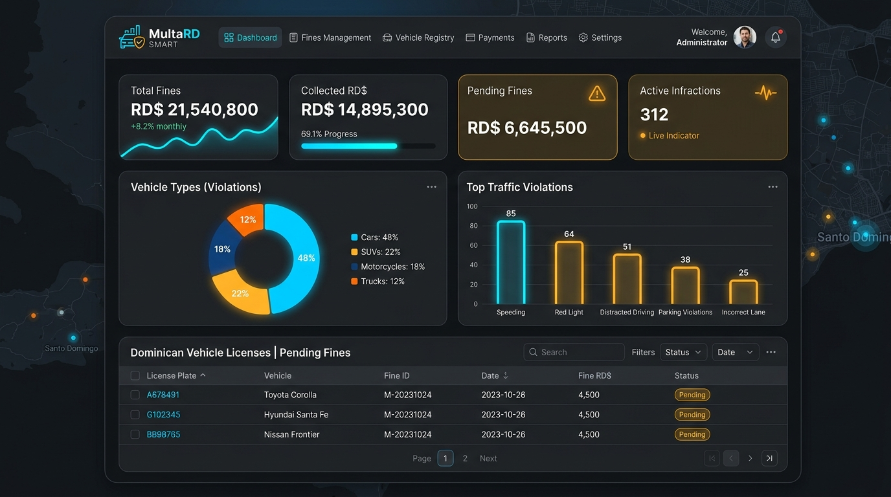
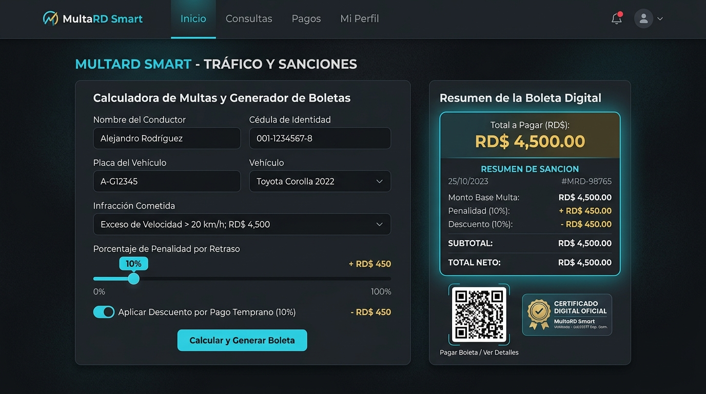

# 🚗 MultaRD Smart | Sistema de Gestión y Cálculo de Multas de Tránsito


[](https://github.com/JuanParra2026/MultaRD-Smart)
[](https://www.python.org/)
[](https://flask.palletsprojects.com/)
[](https://github.com/JuanParra2026/MultaRD-Smart/blob/main/Analisis_Multas_Transito.ipynb)
[](https://dashboard.render.com)
[](LICENSE)

> **Proyecto Educativo, Demostrativo y de Análisis de Datos**  
> Desarrollado con arquitectura moderna: **Python (Flask)**, **Pandas**, **Jupyter Notebook**, **HTML5 Semántico**, **CSS3 Custom Properties (Modo Claro/Oscuro)** y **JavaScript ES6+**.

---

## 🔗 Enlaces Principales del Proyecto

- 🐙 **Repositorio Oficial en GitHub:**  
  👉 [https://github.com/JuanParra2026/MultaRD-Smart](https://github.com/JuanParra2026/MultaRD-Smart)

- 📓 **Cuaderno de Python (Jupyter Notebook Interactivo en GitHub):**  
  👉 [https://github.com/JuanParra2026/MultaRD-Smart/blob/main/Analisis_Multas_Transito.ipynb](https://github.com/JuanParra2026/MultaRD-Smart/blob/main/Analisis_Multas_Transito.ipynb)

- 🚀 **Panel de Despliegue en Render (Juan Parra):**  
  👉 [https://dashboard.render.com](https://dashboard.render.com)

- 🌐 **Acceso Web en Producción (Render):**  
  👉 [https://multard-smart.onrender.com](https://multard-smart.onrender.com) *(o la URL asignada al crear tu Web Service)*

- 💻 **Servidor Local de Desarrollo (Flask):**  
  👉 [http://127.0.0.1:5000](http://127.0.0.1:5000)

---

## 📸 Vistas de la Plataforma

| Dashboard de Métricas y KPIs | Calculadora y Boleta Digital |
| :---: | :---: |
|  |  |

---

## 📋 Descripción del Proyecto

**MultaRD Smart** es una plataforma web integral diseñada para la consulta, registro, cálculo, fiscalización simulada y análisis estadístico de infracciones de tránsito en la República Dominicana.

El proyecto cuenta con una arquitectura híbrida que permite:
1. **Ejecución como Servidor Web Flask (Backend + REST API + MVC)** con endpoints de datos y servicios de exportación.
2. **Ejecución Directa en Navegador (Frontend SPA)** con almacenamiento reactivo en `LocalStorage`.
3. **Módulo de Análisis de Datos** mediante Jupyter Notebook ([`Analisis_Multas_Transito.ipynb`](Analisis_Multas_Transito.ipynb)) para estudio estadístico y cuantitativo.

> ⚠️ **Aviso de Responsabilidad Legal:**  
> Esta aplicación ha sido desarrollada exclusivamente con **fines pedagógicos, de análisis y demostrativos**. Los montos, infracciones y registros son datos configurables o simulados y no representan un sistema oficial de la **Policía Nacional**, **DIGESETT**, **INTRANT** ni de ninguna institución gubernamental de la República Dominicana.

---

## 📁 Estructura del Proyecto y Enlaces a la Documentación

```text
APP PARRA/
│
├── .agents/
│   └── skills/
│       └── flask-docs-architect/
│           └── SKILL.md                          # Habilidades e instrucciones del agente IA para arquitectura Flask
│
├── .markdown-collab/
│   └── .mcp-server.json                          # Configuración del servidor MCP para documentos Markdown
│
├── .venv/                                        # Entorno virtual aislado de Python con librerías instaladas
│
├── app/                                          # Núcleo de la aplicación web Flask
│   ├── __init__.py                               # Fábrica de aplicaciones (create_app) y configuración
│   ├── routes.py                                 # Controladores, vistas y endpoints de la API REST
│   ├── data/                                     # Conjuntos de datos base y persistencia
│   │   ├── multas_iniciales.json                 # Dataset JSON de actas emitidas
│   │   ├── tarifas.json                          # Catálogo oficial simulado de tarifas de infracción
│   │   └── estadisticas_viales.csv               # Dataset tabular de tránsito para análisis de datos
│   ├── templates/                                # Plantillas HTML renderizadas por Flask
│   │   └── index.html                            # Vista principal del sistema
│   └── static/                                   # Recursos estáticos de la aplicación
│       ├── css/
│       │   └── style.css                         # Sistema de diseño con temas Dark/Light
│       └── js/
│           └── script.js                         # Motor JavaScript, cálculos, filtros y Chart.js
│
├── docs/                                         # Documentación académica y técnica del proyecto
│   ├── documentacion/                            # Manuales y guías detalladas
│   │   ├── manual_usuario.md                     # Guía de operación para el usuario final
│   │   ├── manual_administrador.md               # Guía técnica de mantenimiento y despliegue
│   │   ├── guia_calculo_y_tarifas_viales.md      # Metodología de cálculo, tarifas y fiscalización vial
│   │   └── diccionario_datos.md                  # Especificación y esquema de entidades
│   ├── images/
│   │   ├── arquitectura.png                      # Diagrama visual de la arquitectura del software
│   │   ├── banner_multard.png                    # Banner tecnológico oficial
│   │   ├── dashboard_preview.png                 # Captura de pantalla del dashboard
│   │   └── calculadora_multas.png                # Captura de pantalla de la calculadora
│   ├── arquitectura.md                           # Explicación técnica de la estructura del sistema y flujo
│   ├── evidencia_antigravity.md                  # Registro de desarrollo asistido por IA (Antigravity)
│   ├── presentacion_sustentacion.md              # Guion estructurado para sustentación del proyecto
│   └── tutorial.md                               # Guía paso a paso para el usuario o estudiante
│
├── .gitignore                                    # Lista de exclusión para control de versiones Git
├── .mcp.json                                     # Configuración de protocolo MCP
├── Analisis_Multas_Transito.ipynb                # Notebook interactivo de Jupyter con análisis de datos viales
├── index.html                                    # Interfaz web directa / punto de entrada estático
├── Procfile                                      # Configuración para despliegue en la nube (Render / Heroku)
├── README.md                                     # Portada principal e instrucciones del proyecto
├── requirements.txt                              # Dependencias y librerías de Python requeridas
├── runtime.txt                                   # Especificación de versión Python para Render
├── run.py                                        # Script principal de encendido del servidor Flask
├── script.js                                     # Script JavaScript raíz
└── style.css                                     # Hoja de estilos CSS raíz
```

---

## 📚 Enlaces Directos a la Documentación Técnica

- 🚗 **[Guía de Cálculo, Tarifas y Fiscalización Vial](docs/documentacion/guia_calculo_y_tarifas_viales.md):** Fórmulas matemáticas, desglose de recargos y catálogo de severidad.
- 📘 **[Manual de Usuario](docs/documentacion/manual_usuario.md):** Manual paso a paso para emisión de multas, búsquedas y comprobantes.
- 🛠️ **[Manual del Administrador](docs/documentacion/manual_administrador.md):** Configuración de servidor, despliegue y copias de seguridad.
- 📖 **[Diccionario de Datos y Esquemas](docs/documentacion/diccionario_datos.md):** Esquemas y campos de las entidades de multas e infracciones.
- 🏛️ **[Arquitectura del Software](docs/arquitectura.md):** Diagrama y flujo de capas MVC y API REST.
- 🎓 **[Presentación del Proyecto](docs/presentacion_sustentacion.md):** Guion de 15 minutos para exposición del sistema.
- 📖 **[Tutorial de Uso del Sistema](docs/tutorial.md):** Guía rápida para nuevos usuarios.
- 🤖 **[Evidencia de Desarrollo con IA](docs/evidencia_antigravity.md):** Registro de desarrollo asistido en Google Antigravity.

---

## 🚀 Puesta en Marcha y Modos de Ejecución

### Opción 1: Servidor Web Flask (Modo Completo Backend + API)

1. **Activar el entorno virtual de Python**:
   - En Windows (PowerShell):
     ```powershell
     .\.venv\Scripts\Activate.ps1
     ```
2. **Instalar dependencias (si no están instaladas)**:
   ```powershell
   pip install -r requirements.txt
   ```
3. **Encender el servidor**:
   ```powershell
   python run.py
   ```
4. **Acceder en el navegador**:  
   Abra [http://127.0.0.1:5000](http://127.0.0.1:5000)

---

### Opción 2: Modo Directo Frontend (Live Server o Doble Clic)

1. **Doble Clic:** Abra directamente el archivo [`index.html`](index.html) en Google Chrome, Edge o Firefox.
2. **Live Server (VS Code):** Haga clic derecho sobre `index.html` -> *Open with Live Server*.

---

### Opción 3: Análisis de Datos en Python (Jupyter Notebook)

1. Abra **Visual Studio Code** o inicie Jupyter:
   ```powershell
   jupyter notebook
   ```
2. Abra el archivo [`Analisis_Multas_Transito.ipynb`](Analisis_Multas_Transito.ipynb).
3. Ejecute las celdas para realizar el análisis estadístico descriptivo, tablas cruzadas y gráficos de distribución sobre el dataset vial.

---

## 🏛️ Endpoints de la API REST (Flask)

| Método | Endpoint | Descripción | Enlace Directo (Servidor Local) |
| :--- | :--- | :--- | :--- |
| `GET` | `/` | Renderiza la interfaz gráfica interactiva | [http://127.0.0.1:5000/](http://127.0.0.1:5000/) |
| `GET` | `/api/health` | Estado de salud y versión de la API | [http://127.0.0.1:5000/api/health](http://127.0.0.1:5000/api/health) |
| `GET` | `/api/info` | Metadatos y stack tecnológico de la plataforma | [http://127.0.0.1:5000/api/info](http://127.0.0.1:5000/api/info) |
| `GET` | `/api/tarifas` | Catálogo de tarifas base de infracción | [http://127.0.0.1:5000/api/tarifas](http://127.0.0.1:5000/api/tarifas) |
| `GET` | `/api/multas` | Listado de todas las multas registradas | [http://127.0.0.1:5000/api/multas](http://127.0.0.1:5000/api/multas) |
| `POST`| `/api/multas` | Registro y cálculo de una nueva infracción | `Endpoint POST` |
| `GET` | `/api/estadisticas` | KPIs y métricas agregadas | [http://127.0.0.1:5000/api/estadisticas](http://127.0.0.1:5000/api/estadisticas) |
| `GET` | `/api/exportar/csv` | Descarga directa del dataset de multas en CSV | [http://127.0.0.1:5000/api/exportar/csv](http://127.0.0.1:5000/api/exportar/csv) |
| `GET` | `/api/exportar/json`| Descarga directa del dataset de multas en JSON | [http://127.0.0.1:5000/api/exportar/json](http://127.0.0.1:5000/api/exportar/json) |
