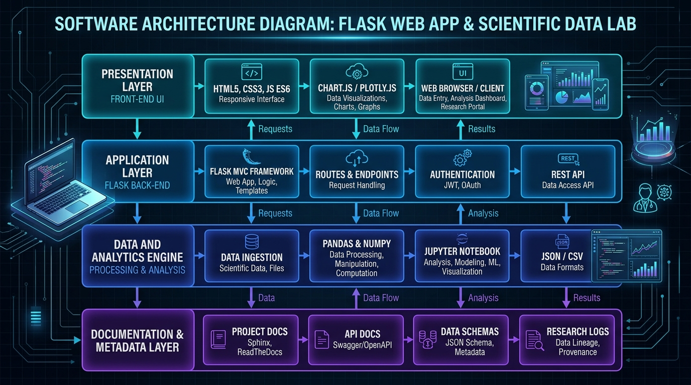
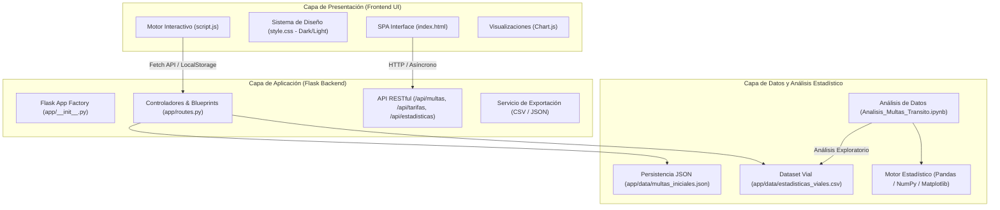

# 🏛️ Arquitectura del Software | MultaRD Smart

## 1. Visión General
**MultaRD Smart** es una plataforma integral modular diseñada con un backend ligero en **Python (Flask)** y un frontend reactivo de alto rendimiento (**HTML5 semántico, CSS3 Custom Properties y JavaScript Moderno ES6+**), complementado con capacidades de análisis de datos viales en **Pandas / Jupyter Notebook**.

---

## 2. Diagrama de Arquitectura

---

## 3. Componentes Principales

### 3.1 Backend (Flask MVC Modular)
- **Fábrica de Aplicaciones (`app/__init__.py`)**: Inicializa la aplicación Flask permitiendo configuraciones aisladas para desarrollo, pruebas y producción.
- **Rutas y API REST (`app/routes.py`)**: 
  - Gestión del ciclo de vida de multas (`GET`, `POST`).
  - Consulta de catálogo tarifario oficial de infracciones.
  - Endpoints de métricas agregadas y analítica.
  - Generador de descargas CSV y JSON bajo demanda.
- **Punto de Entrada (`run.py`)**: Levanta el servidor en `http://127.0.0.1:5000` con detección automática de variables de entorno y modo debug.

### 3.2 Frontend (UI/UX de Alta Fidelidad)
- **Modo Híbrido**: Puede consumirse a través de las plantillas Jinja2 de Flask (`app/templates/index.html`) o de manera directa estática (`index.html`).
- **Diseño Glassmorphism & Modo Claro/Oscuro**: Variables CSS dinámicas (`[data-theme="dark"]`).
- **Dashboard en Tiempo Real**: Tarjetas KPI, gráficos interactivos con **Chart.js** y tabla de búsqueda instantánea.
- **Calculadora en Vivo**: Fórmulas con desglose transparente de montos base, recargos y descuentos.

### 3.3 Capa de Análisis de Datos
- **Dataset (`app/data/estadisticas_viales.csv`)**: Registros estructurados sobre tipos de faltas, montos, conductores, vehículos y reincidencia.
- **Notebook (`Analisis_Multas_Transito.ipynb`)**: Análisis estadístico descriptivo, tablas cruzadas y visualización con Pandas y Matplotlib.
