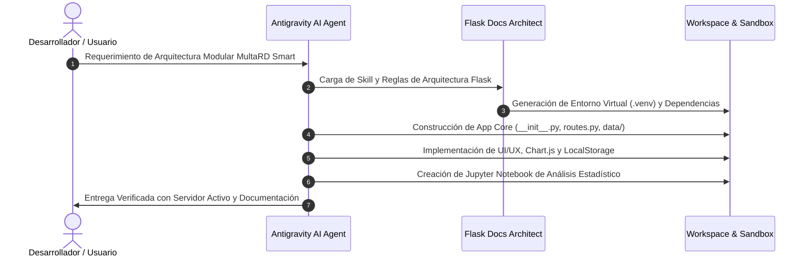

# 🤖 Evidencia de Desarrollo Asistido por IA | MultaRD Smart

## 1. Ficha Técnica del Proceso
- **Proyecto:** MultaRD Smart - Sistema de Gestión de Multas y Análisis de Datos Viales
- **Entorno de Asistencia:** Google Antigravity IDE (Gemini Advanced Agentic Coding)
- **Habilidad Especializada:** `.agents/skills/flask-docs-architect`
- **Protocolo de Integración:** Model Context Protocol (MCP) vía `.mcp.json` y `.markdown-collab`

---

## 2. Metodología de Pair Programming con IA

El desarrollo de este sistema se realizó mediante un flujo iterativo de ingeniería de software guiado por agentes autónomos:

---

## 3. Evidencias de Modularidad y Buenas Prácticas
1. **Separación de Responsabilidades (SoC):**
   - Estructura backend Flask limpia, con datos desacoplados en `app/data/` y frontend modular en `app/static/` y `app/templates/`.
2. **Documentación Viva y Reproducibilidad:**
   - Creación automatizada de `requirements.txt`, `Procfile` y `run.py` garantizando despliegue continuo y portabilidad entre sistemas operativos.
3. **Validación y Analítica:**
   - Análisis estadístico con visualización en `Analisis_Multas_Transito.ipynb` para análisis de datos del sistema de multas.
